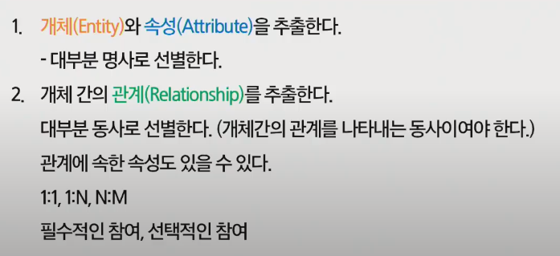
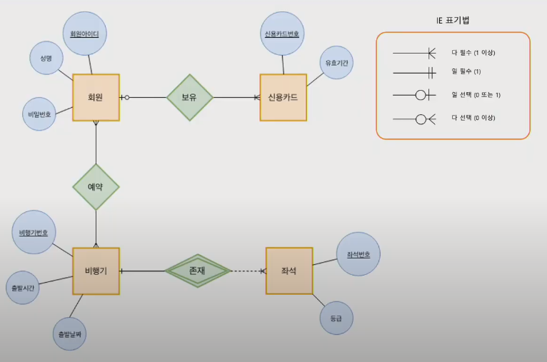

# 프로젝트를 위한 RDBMS 설계방법

> - 프로젝트, 명세서 등의 정보 요구사항에 대한 정확한 이해
> - 분석자, 개발자, 사용자간의 원활한 의사소통 수단
> - 데이터 중심의 분석 방법
> - 현행 시스템만이 아닌 신규 시스템 개발의 기초 제공

## 1. 설계 프로세스

### 1.1. 설계를 위한 요구사항 분석

> 데이터베이스에 대한 사용자의 요구사항을 수집하고 분석해서 아래와 같이 요구사항(기능) 명세서를 작성

### 1.2. 개념적 설계

> 작성한 요구사항 명세서에서 데이터베이스를 구성하는데 필요한 개체, 속성, 개체 간의 관계를 추출하여 ERD 생성

- 개체와 속성

  - `개체`는 대부분 명사로 이루어져 있습니다.
  - `속성`과 구별하여 추출합니다.
  - 개체 간의 `관계`는 여러가지로 분류해서 정의 됩니다.

- ERD 작성

  

### 1.3. 논리적 설계

> 모든 개체는 릴레이션(Table)으로 변환 (개체 : 테이블, 속성 : 테이블의 속성)

- N:M 관계는 Table 으로 변환
  - 관계 : 릴레이션 이름
  - 관계속성 : 릴레이션 속성
- 1:N 관계는 외래키로 표현
  - 일반적으로 1:N 관계에서 1측 개체의 기본키를 N측 릴레이션에 포함시키고 외래키(FK)로 지정
- 1:1 관계는 외래키로 표현
  - 외래키를 주고 받음
- 다중 값 속성은 독립 릴레이션으로 변환
  - 릴레이션에서는 다중 값 ㅅ곡성을 가질 수 없으므로 다중 값 속성은 별도의 릴레이션으로 생성해야 함

### 1.4. 물리적 스키마 및 구현

> ERD를 실제 테이블로 생성한다.

- Workbench 같은 DB Tool 이나 SQL 스크립트 사용으로도 가능해야 함

